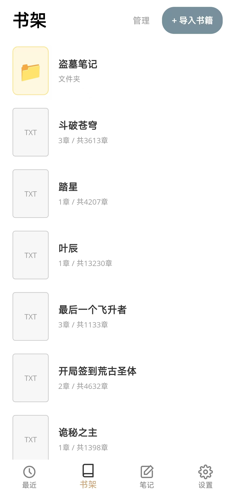
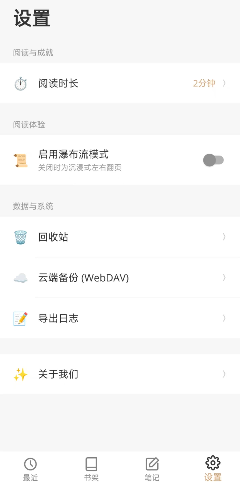

# 📖 MonoRead

<div align="center">
  
  <h3>极简主义的跨平台纯文本阅读器</h3>
  
  [](https://dotnet.microsoft.com/)
  []()
  [](https://opensource.org/licenses/MIT)
</div>

---

## ✨ 核心特性 (Features)

MonoRead 是一款基于 .NET MAUI 构建的现代化跨平台阅读引擎，致力于提供沉浸式的本地与云端纯文本（TXT）阅读体验。

- 🚀 **极速拆解引擎**：支持本地多文件与 WebDAV（如坚果云）多线程批量导入，内置毫秒级 TXT 章节拆解算法。
- 🎨 **极简视觉美学**：对标顶级阅读应用的莫兰迪色系与极简 UI，沉浸式底部导航，告别一切视觉干扰。
- ☁️ **云端双向同步**：内置完整 WebDAV 协议栈，实现跨设备的书籍与进度同步。
- 📝 **思想留存系统**：原生的文本高亮划线与读书笔记架构，支持笔记统一管理与导出。
- 📊 **成就数据看板**：GitHub 同款“阅读热力图”与阅读历程统计。
- 🛡️ **商业级底层架构**：采用社区标准的 `CommunityToolkit.Mvvm`、SQLite 离线存储与 Entity Framework Core，完美兼容 .NET 10 Native AOT 规范。

## 📸 屏幕截图 (Screenshots)

> 💡 **Tip:**  App 运行截图
> 
> | 极简书架 | 沉浸阅读 | 笔记管理 |
> |:---:|:---:|:---:|
> |  |  |  |

> 
> | 笔记详情 | 设置画面 | 云端备份 |
> |:---:|:---:|:---:|
> |  |  |  |

## 🛠️ 技术栈 (Tech Stack)

- **框架**: [.NET 10 MAUI](https://learn.microsoft.com/en-us/dotnet/maui/)
- **架构模式**: MVVM (`CommunityToolkit.Mvvm`)
- **本地数据库**: SQLite + Entity Framework Core
- **消息总线**: `WeakReferenceMessenger` 解耦通信
- **云端接入**: WebDAV 协议

## 🚀 快速开始 (Getting Started)

### 环境要求
- Visual Studio 2026  或 Rider
- .NET 10.0 SDK
- MAUI 工作负载 (Android / iOS / Windows)

### 编译运行
1. 克隆本仓库：
   ```bash
   git clone [https://github.com/YourUsername/MonoRead.git](https://github.com/YourUsername/MonoRead.git)